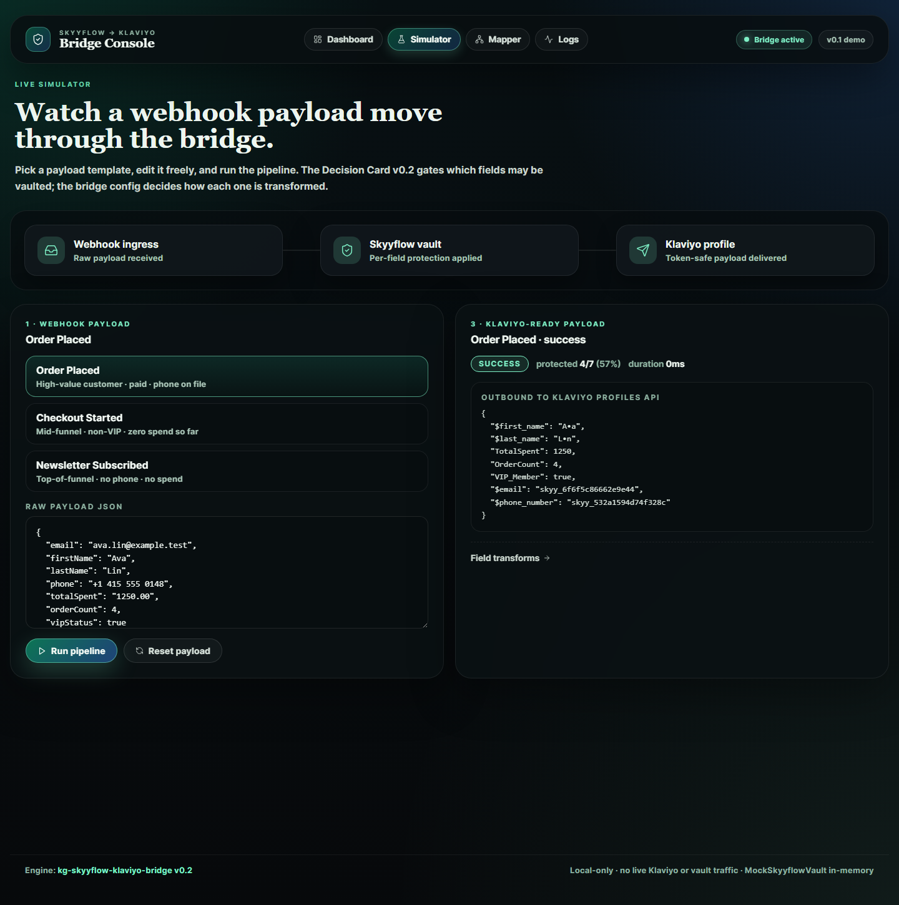

# kg-skyyflow-klaviyo-bridge

[](https://github.com/mizcausevic-dev/kg-skyyflow-klaviyo-bridge/actions/workflows/ci.yml)
[](https://www.gnu.org/licenses/agpl-3.0)
[](https://nodejs.org/)

Skyyflow vault bridge for Klaviyo profile exports. Reads an [AI Procurement Decision Card v0.2](https://github.com/mizcausevic-dev/ai-procurement-decision-spec), tokenizes the PII the buyer explicitly authorized for vaulting, and gates detokenize reveal by caller role. Library + CLI.

## Why this exists

Lifecycle marketing pipelines routinely move raw PII into vendor systems before anyone has reviewed who downstream sees it. Growth-ops teams need a tokenize-at-the-seam control they can wire into their Klaviyo ingestion path without re-implementing the access contract per pipeline. This bridge reuses the same Skyyflow vault contract used in two sibling surfaces:

- [rag-sentinel](https://github.com/mizcausevic-dev/rag-sentinel) — tokenize-before-index for RAG pipelines
- [deal-desk-workspace](https://github.com/mizcausevic-dev/deal-desk-workspace) — RBAC-aware reveal for deal desk surfaces

One buyer-published Decision Card, three enforcement points.

## Live visual demo

Want to see this run in a browser? [skyyflow-klaviyo-bridge-console](https://github.com/mizcausevic-dev/skyyflow-klaviyo-bridge-console) is a React companion that pipes this engine through a live operator surface — webhook simulator with a 3-stage animated pipeline, field mapper, sync log stream, dashboard with charts. Same `transform()` function, just visible.



## What this is not

- Not a hosted Skyyflow vault. The shipped `MockSkyyflowVault` is in-memory and deterministic — a real deployment swaps in an HTTP adapter behind the same `SkyyflowVault` interface.
- Not a Klaviyo SDK. The bridge consumes Klaviyo-shaped profile exports; it does not call the Klaviyo Profiles API directly.
- Not a compliance attestation. The bridge produces evidence and posture readiness, not certified compliance.

## Install

```bash
npm install kg-skyyflow-klaviyo-bridge
```

Or use the CLI globally:

```bash
npm install -g kg-skyyflow-klaviyo-bridge
```

## CLI

### audit

```bash
kg-skyyflow-klaviyo audit fixtures/sample-klaviyo-profiles.json \
  --decision-card fixtures/sample-decision-card.json
```

Cross-references the export against the Decision Card and emits a Markdown coverage report listing findings (unauthorized PII still on profiles, missing reveal roles, missing audit URI).

Use `--format summary` for a one-line, scriptable summary.

### tokenize

```bash
kg-skyyflow-klaviyo tokenize fixtures/sample-klaviyo-profiles.json \
  --decision-card fixtures/sample-decision-card.json \
  --out vaulted.json
```

Replaces authorized PII fields with `skyy_<hex16>` tokens. Unauthorized fields stay raw — `audit` is what surfaces them so you can broaden the Decision Card or strip them at the source.

### detokenize

```bash
kg-skyyflow-klaviyo detokenize vaulted.json --role growth-ops-lead
```

Walks every vaulted field and asks the vault to detokenize under the caller's role. Reveal is gated by `(callerRoles ∩ revealRoles)`. Every attempt — successful or denied — appears in the reveal audit table.

### transform (v0.2)

```bash
kg-skyyflow-klaviyo transform fixtures/webhook-payload-templates.json \
  --bridge-config fixtures/sample-bridge-config.json \
  --decision-card fixtures/sample-decision-card.json \
  --event-name "Order Placed"
```

Runs a single raw webhook payload through the full pipeline: applies per-field protection (`none` / `masked` / `tokenized`) per the bridge config, gates `tokenized` fields against the Decision Card's `fields_authorized`, and emits a Klaviyo-ready payload plus a complete sync log. `npm run demo:transform` runs all three bundled payload templates and prints results.

## Per-field protection levels (v0.2)

The Decision Card declares **which** raw fields may be vaulted. The bridge config declares **how** each field is transformed:

| Protection | Behavior | Decision Card check |
| --- | --- | --- |
| `none` | Raw value passes through (with type coercion to `string` / `number` / `boolean`) | None — operator explicit |
| `masked` | Field-shape-aware mask: `j••@example.test`, `+• ••• ••• 0148`, `M••••s` | None — no vault involvement |
| `tokenized` | Vault-backed `skyy_<hex16>` token via the Skyyflow vault | Field **must** appear in `fields_authorized`. If not, the field is dropped and the sync log marks `unauthorized-tokenization` |

> The shipped MockSkyyflowVault is single-process. Standalone `detokenize` against a previously-written `vaulted.json` will produce `denied-no-such-token` because the in-memory map is empty. Wire `tokenize | detokenize` in the same process, or replace the vault with a hosted adapter for cross-process reveal.

## Library

```typescript
import {
  MockSkyyflowVault,
  audit,
  tokenize,
  detokenize,
} from "kg-skyyflow-klaviyo-bridge";

const report = audit(profilesExport, decisionCard);
const vault = new MockSkyyflowVault("kg-klaviyo-vault-2026-q2");
const { vaultedExport, events } = await tokenize(profilesExport, decisionCard, vault);
const revealed = await detokenize(vaultedExport, vault, {
  callerRoles: ["growth-ops-lead"],
});
```

## Decision Card contract

The bridge reads a single `data_vault_targets[]` entry where `vendor: "skyyflow"`. Fields:

| Field | Meaning |
| --- | --- |
| `vendor` | Must be `"skyyflow"` for this bridge to engage |
| `vault_id` | Stamped onto vault audit-stream events |
| `vault_url` | Where the hosted adapter would talk to (informational here) |
| `fields_authorized` | Logical field names the bridge may tokenize (`email`, `phone_number`, `properties.<key>`, …) |
| `reveal_roles` | Caller roles authorized to detokenize |
| `reveal_audit_uri` | Public location where reveal audit events get published; absence is a `medium` finding |

See [fixtures/sample-decision-card.json](./fixtures/sample-decision-card.json) for a complete example.

## Testing

```bash
npm install
npm run typecheck
npm run coverage
npm run build
npm run demo
```

Coverage threshold is **80%** across statements, branches, functions, and lines.

## License

[AGPL-3.0-or-later](./LICENSE). Same license as the sibling Klaviyo and Skyyflow-pattern repos.

## Related

- [ai-procurement-decision-spec](https://github.com/mizcausevic-dev/ai-procurement-decision-spec) — Decision Card v0.2 JSON Schema
- [rag-sentinel](https://github.com/mizcausevic-dev/rag-sentinel) — tokenize-before-index for RAG
- [deal-desk-workspace](https://github.com/mizcausevic-dev/deal-desk-workspace) — RBAC-aware reveal for deal desk
- [klaviyo-flow-consent-audit](https://github.com/mizcausevic-dev/klaviyo-flow-consent-audit) — Klaviyo consent / suppression / deliverability evidence
